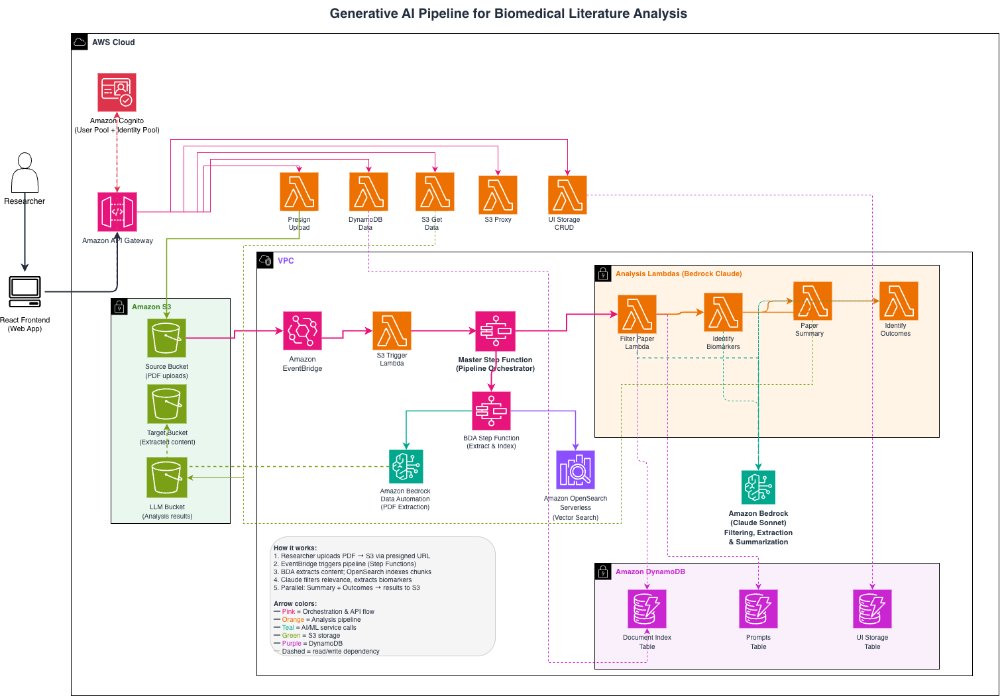

# Generative AI Pipeline for Biomedical Literature Analysis

A serverless AI pipeline on AWS that automates scientific literature analysis. Upload a biomedical research PDF, and the system determines relevance, extracts biomarkers and gene variants, answers predefined research questions, and produces evidence-based summaries with citations mapped back to the original document.

## Architecture

The pipeline is orchestrated by AWS Step Functions and uses:

- **Amazon Bedrock Data Automation (BDA)** for structured PDF extraction (tables, figures, sections, bounding boxes)
- **Amazon Bedrock (Claude)** for intelligent filtering, biomarker extraction, outcome analysis, and summarization
- **Amazon OpenSearch Serverless** for vector-based semantic search over document chunks
- **AWS CDK** for infrastructure as code (entire stack deployed from a single application)

### Pipeline Flow



The pipeline processes biomedical PDFs through a fully serverless, event-driven workflow orchestrated by two nested AWS Step Functions. Below is the end-to-end flow:

#### 1. Authentication & Upload

- The researcher logs into the **React frontend** via **Amazon Cognito** (User Pool + Identity Pool).
- To upload a PDF, the frontend calls the **Amazon API Gateway** REST endpoint (`POST /document`), which invokes the **Presign Upload Lambda**.
- The Lambda returns a presigned S3 URL, and the frontend uploads the PDF directly to the **S3 Source Bucket**.

#### 2. Event-Driven Trigger

- The S3 Source Bucket emits an **Object Created** event to **Amazon EventBridge**.
- An EventBridge rule routes the event to the **S3 Trigger Lambda**.
- The Trigger Lambda records the document in the **DynamoDB Document Index** table and starts the **Master Step Function**.

#### 3. PDF Extraction & Indexing (BDA Sub-Step Function)

The Master Step Function first invokes a nested **BDA Step Function** that:

1. Calls **Amazon Bedrock Data Automation (BDA)** to extract the PDF into structured markdown with element-level granularity (tables, figures, sections, bounding boxes).
2. Writes the extracted content (including `fulltext.json`) to the **S3 Target Bucket**.
3. Chunks the extracted text, generates embeddings, and indexes them in **Amazon OpenSearch Serverless** for downstream semantic search.

#### 4. Relevance Filtering

- The Master Step Function invokes the **Filter Paper Lambda**.
- This Lambda retrieves configurable prompt templates from the **DynamoDB Prompts** table and the extracted content from S3.
- It calls **Amazon Bedrock (Claude Sonnet 4.5)** to determine whether the paper is relevant to the target gene/condition.
- If `should_process = "no"`, the pipeline exits early. If `"yes"`, it proceeds to analysis.

#### 5. Biomarker Extraction

- The **Identify Biomarkers Lambda** uses Claude to extract gene variants, biomarkers, and genetic associations from the paper.
- Results are written to the **S3 LLM Results Bucket** and metadata is updated in DynamoDB.

#### 6. Parallel Analysis (Summary + Outcomes)

After biomarker extraction, two branches execute **in parallel**:

| Branch | Lambda | Purpose |
|--------|--------|---------|
| **4a** | Paper Summary | Generates an evidence-based summary with citations mapped to page/section |
| **4b** | Identify Outcomes | Extracts clinical outcomes, efficacy data, and treatment responses |

Both branches invoke **Amazon Bedrock (Claude)** and write results to the **S3 LLM Results Bucket**.

#### 7. Results & Frontend Access

- The frontend queries results through API Gateway endpoints:
  - `GET /document_metadata` → **DynamoDB Data Lambda** → Document Index table (ownership-checked against the caller's Cognito identity)
  - `GET /document_data` → **S3 Get Data Lambda** → LLM Results Bucket (ownership-checked)
- The researcher views extracted biomarkers, summaries, and outcomes through the web interface with citations linked back to the original PDF.

### AWS Services Used

| Service | Purpose |
|---------|---------|
| Amazon Bedrock Data Automation | PDF extraction with element-level granularity |
| Amazon Bedrock (Claude Sonnet 4.5) | Filtering, extraction, and summarization (via cross-region inference profile) |
| AWS Step Functions | Pipeline orchestration (2 state machines) |
| AWS Lambda | Processing logic (Python 3.14) |
| Amazon S3 | Document storage (source, processed, results) |
| Amazon DynamoDB | Document metadata and prompt templates |
| Amazon OpenSearch Serverless | Vector search over document chunks |
| Amazon Cognito | User authentication |
| Amazon API Gateway | REST API |
| Amazon EventBridge | S3 upload event triggers |

## Prerequisites

- AWS account with access to:
  - Amazon Bedrock — Claude Sonnet 4.5, enabled via a cross-region inference profile (`us.anthropic.claude-sonnet-4-5-20250929-v1:0`). The model IDs are configurable in `cdk/lib/constructs/lambdas/*/bedrock_client.py`.
  - Amazon Bedrock Data Automation
- [AWS CLI](https://docs.aws.amazon.com/cli/latest/userguide/getting-started-install.html) configured with credentials
- [AWS CDK CLI](https://docs.aws.amazon.com/cdk/v2/guide/cli.html) (`npm install -g aws-cdk`)
- [Node.js](https://nodejs.org/) 18+
- Python 3.14+

## Deployment

### 1. Deploy the infrastructure

```bash
cd cdk
npm install
cdk bootstrap   # first time only
cdk deploy
```

### 2. Generate frontend configuration

After CDK deploy completes, generate the frontend config from CloudFormation outputs:

```bash
chmod +x scripts/generate-frontend-config.sh
./scripts/generate-frontend-config.sh
```

This reads the deployed stack outputs (API Gateway URL, Cognito IDs, S3 bucket name) and writes `front-end/src/config.json`.

### 3. Build and run the frontend

```bash
cd front-end
npm install
npm run dev     # local development (http://localhost:5173)
npm run build   # production build
```

> **Note:** The Lambda CORS responses allow the `http://localhost:5173` origin, so run the dev server on port 5173 (Vite's default). For a real deployment, update the allowed origin in the Lambda handlers to your frontend's domain.

### One-step deployment

Alternatively, deploy everything at once:

```bash
chmod +x deploy-and-update.sh
./deploy-and-update.sh
```

## Configuration

### Prompt Templates

Prompt templates and research questions are stored in DynamoDB (the `prompts` table), not hardcoded. This allows you to customize the analysis for different conditions and genes without code changes.

### CDK Configuration

The `cdk/configuration.json` file contains stack configuration including S3 bucket name suffixes, VPC settings, Lambda configurations, and OpenSearch settings. Review and modify as needed before deploying.

## Project Structure

```
├── cdk/                          # AWS CDK infrastructure (TypeScript)
│   ├── lib/
│   │   ├── cdk-stack.ts          # Main stack
│   │   ├── constructs/
│   │   │   ├── lambdas/          # Lambda function source code
│   │   │   │   ├── presign_upload/
│   │   │   │   ├── s3_upload/
│   │   │   │   ├── filter_paper/
│   │   │   │   ├── identify_biomarkers/
│   │   │   │   ├── identify_outcomes/
│   │   │   │   ├── paper_summary/
│   │   │   │   ├── dynamo_data/
│   │   │   │   ├── s3_get_data/
│   │   │   │   ├── s3-proxy/
│   │   │   │   └── ui-storage-crud/
│   │   │   ├── pdf_chunk/        # BDA + OpenSearch constructs
│   │   │   └── state_machine_def.json
│   └── configuration.json
├── front-end/                    # React frontend
├── scripts/                      # Deployment utilities
├── deploy-and-update.sh          # One-step deploy script
└── README.md
```

## Cleanup

To remove all deployed resources:

```bash
cd cdk
cdk destroy
```

Note: S3 buckets with content may need to be emptied manually before stack deletion.

## Security

See [CONTRIBUTING](CONTRIBUTING.md#security-issue-notifications) for reporting security issues.

> **Models:** This sample is tested with Claude Sonnet 4.5 via Amazon Bedrock cross-region inference profiles. Legacy on-demand Claude 3.x model IDs have been retired by Bedrock; see `cdk/lib/constructs/lambdas/*/bedrock_client.py` for the model IDs in use.

> **Context window:** When this solution was originally built, the available models were limited to a 200K-token context window. Newer models now support context windows of up to 1M tokens.

## Disclaimer

The example provided in this repository is for experimental and educational purposes only. It demonstrates concepts and techniques but is not intended for direct use in production environments.

## Authors

- Deepansha Tiwari
- Jeff Harman

## License

This project is licensed under the MIT-0 License. See the [LICENSE](LICENSE) file.
